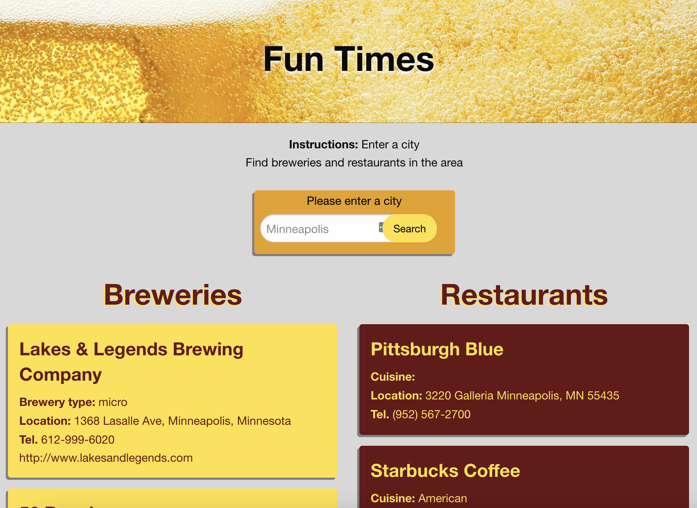

# **Fun Times**
Our website helps the user find nearby breweries and restaurants. It combines two APIs [Open Brewery DB](https://www.openbrewerydb.org/) and [Documenu](https://documenu.com/) creating lists based on the **city** that a user enters into the search form.

---

## **Table of Contents**

1. [Links](#Links)
2. [Built With](#Built-With)
3. [Collaborative Git Projects Notes](#Collaborative-Git-Projects-Notes)
4. [Contributors](#Contributors)

---

## **Links**

[Deployed application](https://nicholasheld.github.io/breweries-team4/)\
[GitHub repository](https://github.com/nicholasheld/breweries-team4)

---

## **Built With**

* HTML
* CSS
* JavaScript
* jQuery
* Foundation CSS
* Documenu API
* Open Brewery DB API

---

## **Collaborative Git Projects Notes**

Order of Operations\
1) Everyone pulls new info
> -    a) git checkout main 
> -    b) git pull origin main
> -    c) git checkout davis_branch
> -    d) git merge main
> -        *remember to use " 'shift'+';' and then 'q' " to move > - on from the message page.
2) Make change on your computer

3) Add Commit and Push to your branch 
> -    a) git status
> -    b) git add .
> -    c) git add /
> -    d) git commit -m"..."
> -    e) git push origin davis_branch

4) Make Pull request on github

5) Someone reviews and approves it
6) Merge to main
7) Everyone pulls new info
    a) git checkout main 
    b) git pull origin main
    c) git checkout davis_branch
    d) git merge main

---

## **Contributors**

[Paige Westra](https://github.com/paigewestra)\
[Davis Kim](https://github.com/dkim525)\
[Nicholas Held](https://github.com/nicholasheld)\
[Samer Saim Aldhr](https://github.com/samersaemeldahr)

